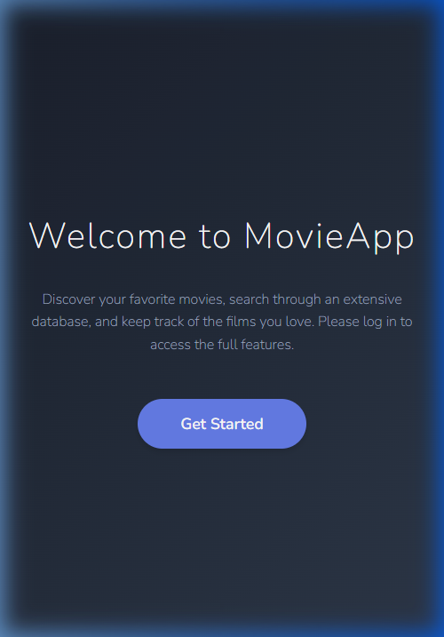
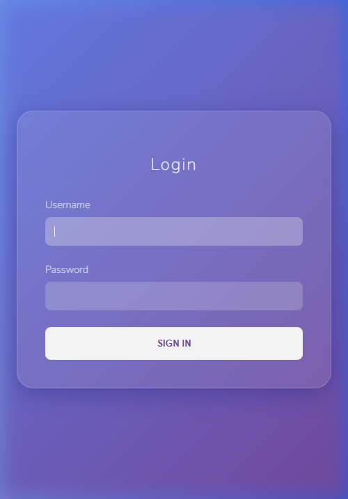
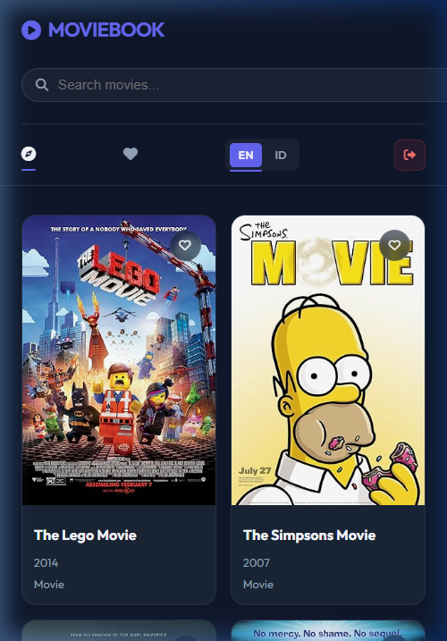
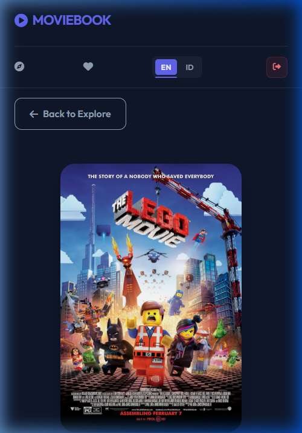

# MovieBook - Movie Catalog Application

A premium movie catalog application built with **Laravel 5.8**, featuring real-time search, favorites management, and multi-language support. Made fully compatible with **PHP 8.2** through custom framework patching.

> [!IMPORTANT]
> **Privacy Note**: Per technical test requirements, this solution and its source code are for evaluation purposes only and are not to be shared publicly on platforms like GitHub, GitLab, or any other media.

---

## 📸 Screenshots

### Welcome & Discovery

### Secure Login

### Movie Exploration (Infinite Scroll)

### Rich Movie Details

---

## 🏗️ Architecture

The application is built using a modern **MVC (Model-View-Controller)** architecture on top of the Laravel framework:

- **Controller Layer**:
    - `MovieController`: Centralizes API interactions, search logic, and favorites processing.
    - `LoginController`: Implements secure static authentication.
- **Service Layer (OMDB Integration)**: Leverages **GuzzleHttp** with a dedicated client configuration for efficient API communication.
- **Database Layer**: Uses **SQLite** for lightweight, persistent storage of favorite movies.
- **Security**: Implemented custom HTTPS scheme forcing for production environments (Railway/Vercel) and trusted proxy headers.
- **Compatibility Layer**: A custom bootstrapping process identifies environment-specific constraints and applies real-time vendor patches for PHP 8.2 compatibility without breaking framework integrity.

## 🛠️ Library & Dependencies

- **Framework**: Laravel 5.8 (Core Backend)
- **HTTP Client**: GuzzleHttp 6.3 (API Requests)
- **Security**: Fideloper/Proxy (Trusted Proxies on Railway)
- **Compatibility**: `php82-patch` (Custom vendor patching script)
- **Frontend**:
    - **jQuery 3.6**: Powering AJAX Search & Infinite Scroll.
    - **Font Awesome 6 Pro**: Professional icon system.
    - **Google Fonts (Outfit)**: Modern, clean typography.
    - **CSS3**: Custom dark-theme with glassmorphism and backdrop-filters.

## 📦 Installation (Local)

1. Clone the repository.
2. Copy `.env.example` to `.env`.
3. Set your `OMDB_API_KEY` in `.env`.
4. Run `composer install`.
5. Run `php artisan migrate`. (Database will be auto-created if missing).
6. Run `php artisan serve`.

---

Developed as part of the Web Developer Technical Test.
